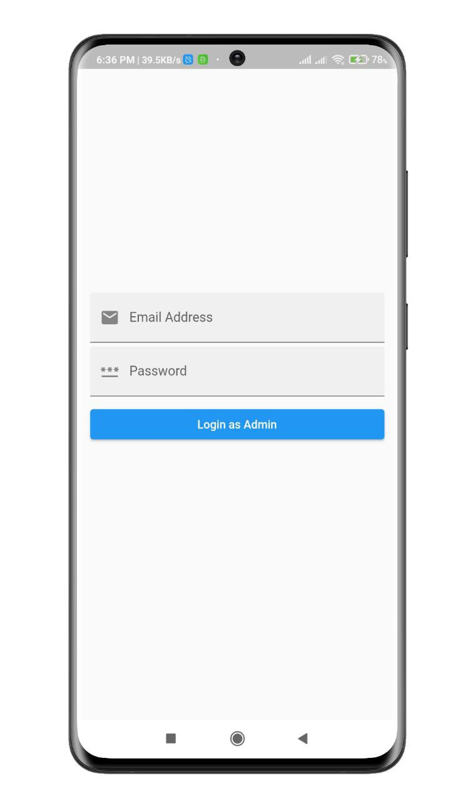
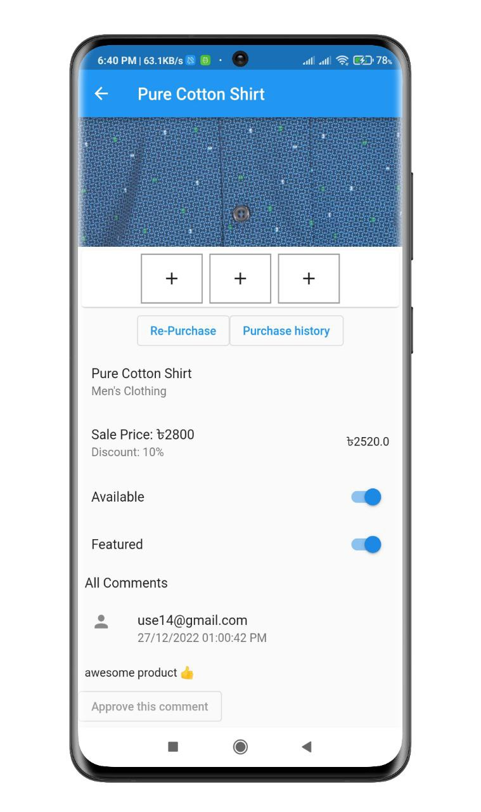
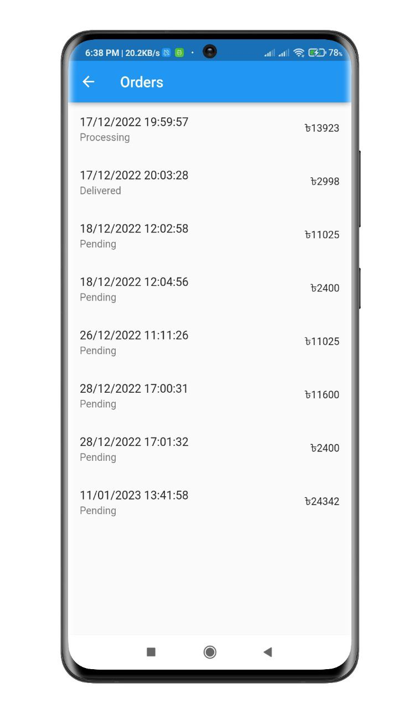
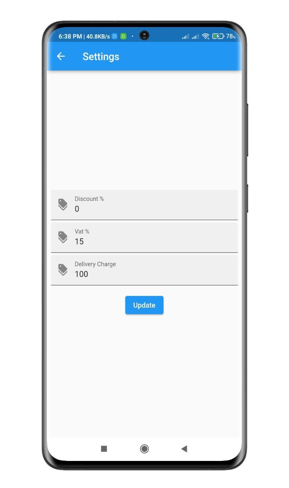

# E-commerce Admin App

Admin can add and remove product, check order summary & update order status. Email verification, Push Notification and Firebase CRUD operation performed in this app. 

## Screenshots

<p align="center">
  
  
  
</p>
<p align="center">
  
  
  
</p>
<p align="center">
  
  
  
</p>
<p align="center">
  
  
  
</p>
<p align="center">
  
  
</p>


## Features

- Admin Login, logout
- Product add, remove, update
- Product Filtering using category
- Product re-purchase and purchase history 
- Approve users comments
- Category add and product count track
- Recive orders, check order details and update order status
- Check all register users
- update discount, vat, delivery charage as settings 
- Report generates
- Real time notification for new users, new orders, new comments
- Admin can send push notification using REST API, Firebase Cloud Messaging


## Setup

Clone the repository

```bash
  git clone https://github.com/muradhossin/ecommerce_admin.git
```
Move to the desired folder

```bash
  cd \ecommerce_admin
```
To run the app, simply write

```bash
  flutter pub get
```
```bash
  flutter run
```
## Tech Stack

**Built With:** Dart, Flutter

**State Management:** Provider

**Backend:** Firebase


