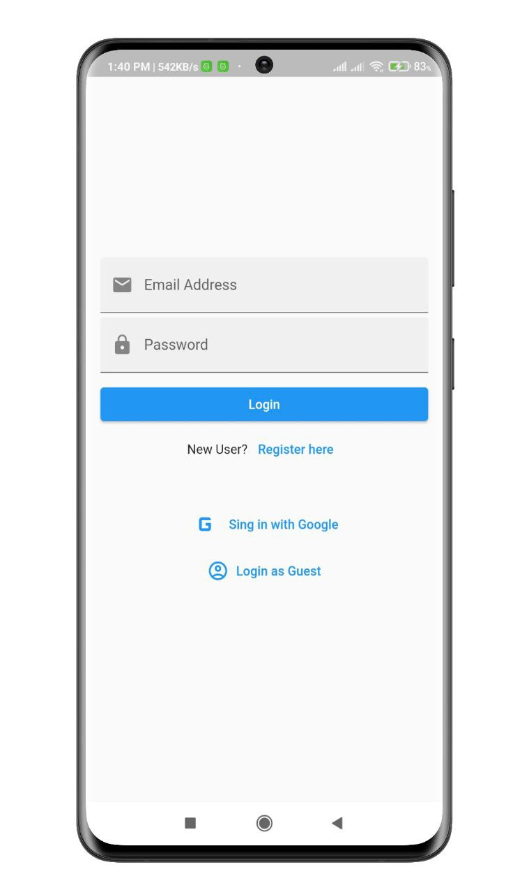
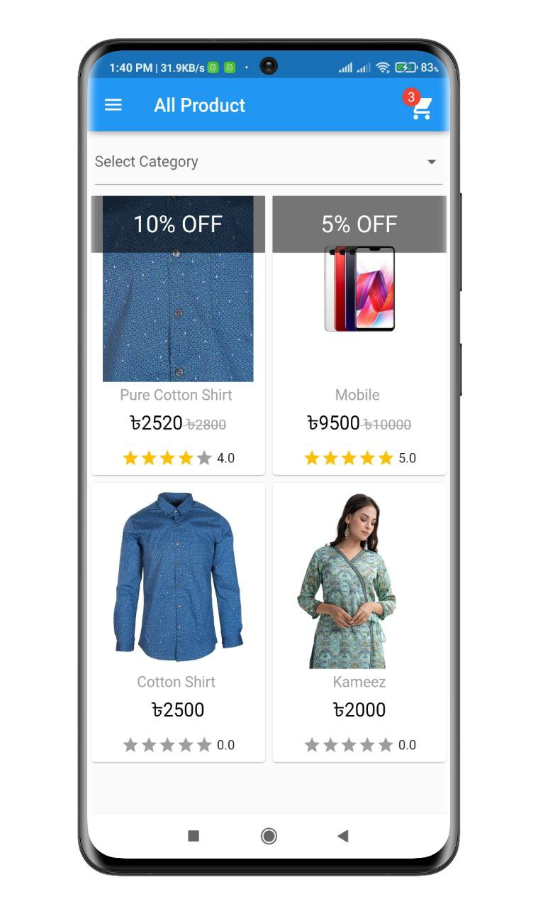
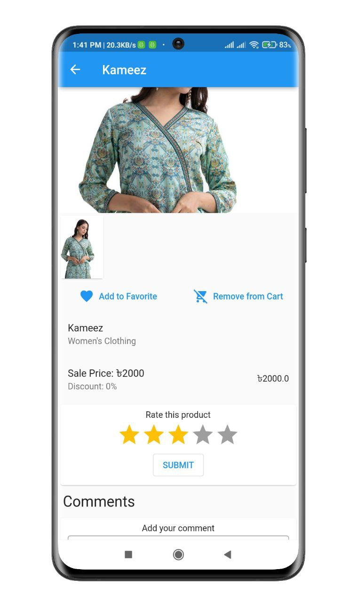
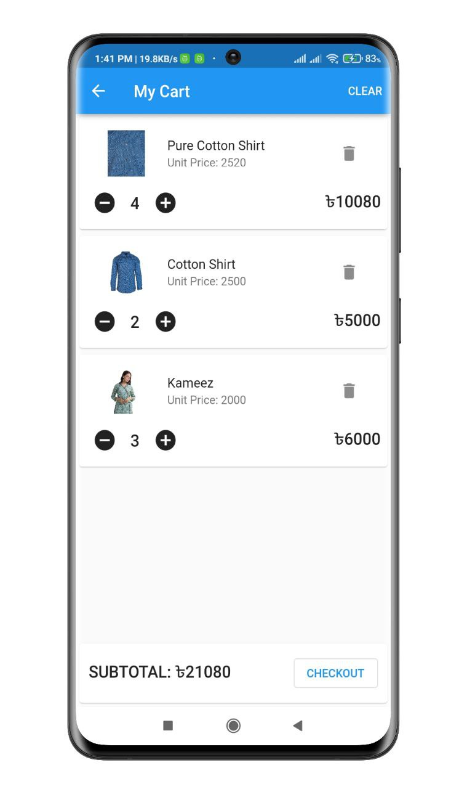
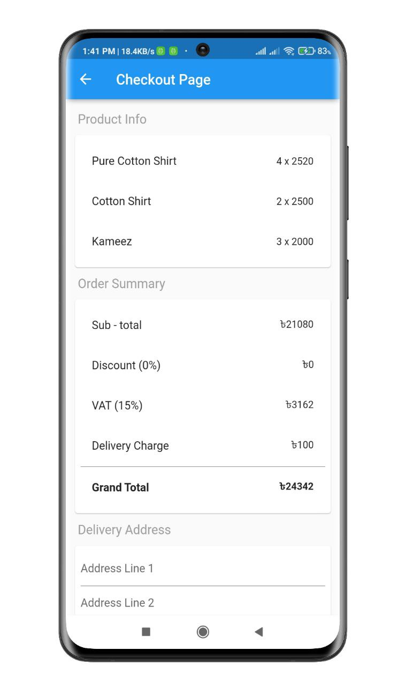
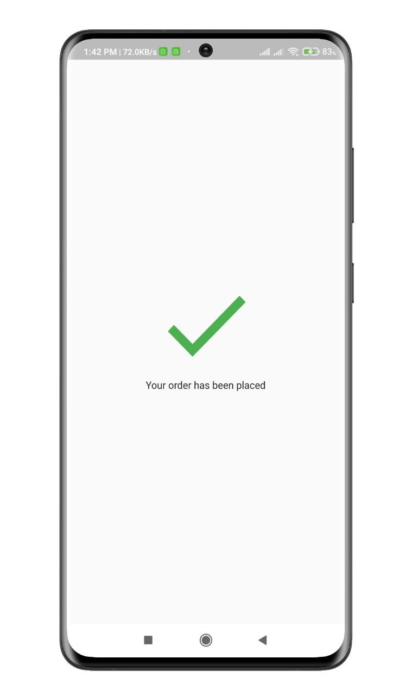
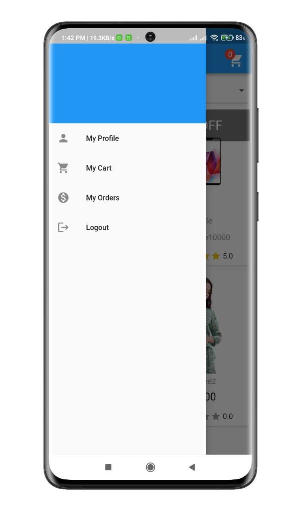
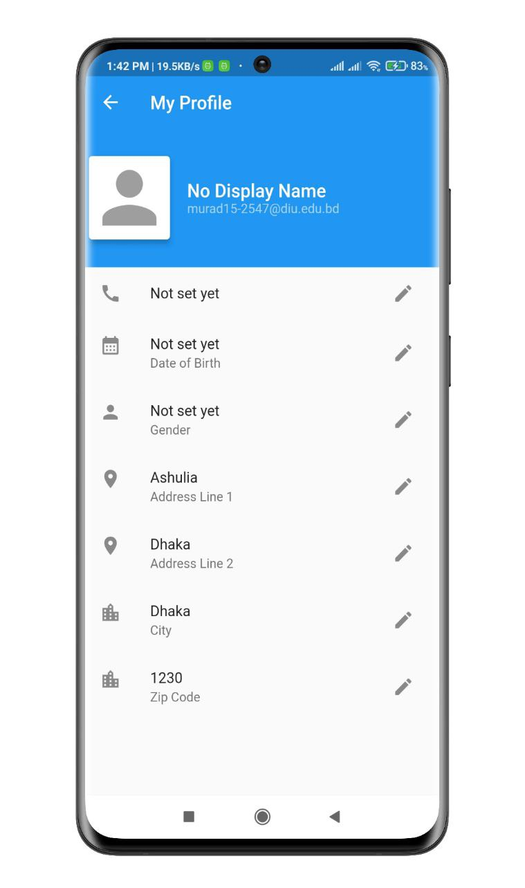
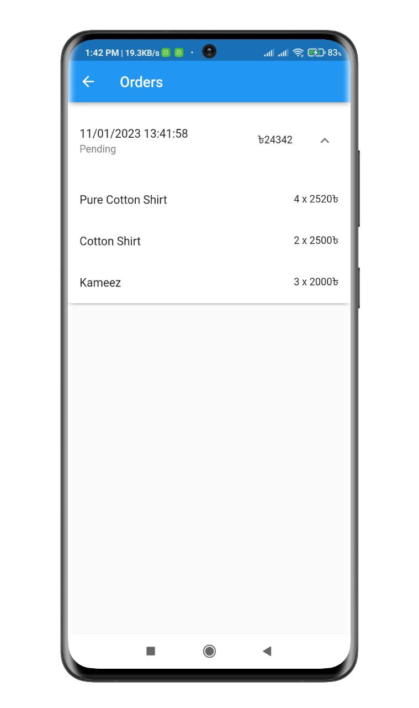

# E-commerce User App

Customer can search and buy product, send feedback of product. Authentication, mobile number verification, email verification, Firebase CRUD operation performed in this app. 

## Screenshots

<p align="center">
  
  
  
</p>
<p align="center">
  
  
  
</p>
<p align="center">
  
  
  
</p>


## Features

- Email verification, Login with Google and Guest Login
- Mobile Number verification
- Product Filtering
- Product can save as Favorite
- Add to Cart, Remove from Cart
- Rating & Comments can do only by verified users
- Payment option
- User Profile Update
- Order Track
- Order History
- Receive notifications from admin app via REST API, Firebase Cloud Messaging


## Setup

Clone the repository

```bash
  git clone https://github.com/muradhossin/ecommerce_user.git
```
Move to the desired folder

```bash
  cd \ecommerce_user
```
To run the app, simply write

```bash
  flutter pub get
```
```bash
  flutter run
```
## Tech Stack

**Built With:** Dart, Flutter

**State Management:** Provider

**Backend:** Firebase


